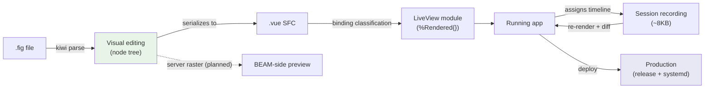

# The chain: design to production

*Status: draft. One artifact changing representations — nothing lost in
translation because there is no translation. Planned edges are dotted and
labeled; see [roadmap](../roadmap/README.md) Phase 3.*

Each arrow is a page:

| Arrow | Mechanism | Where it's explained |
|---|---|---|
| .fig → node tree | Kiwi binary schema parsed natively | [Design](../layers/design.md) |
| node tree → SFC | the tree *is* the component; serialization, not export | [Design](../layers/design.md) |
| SFC → LiveView | compile-time binding classification (server/client/action) | [One program](../layers/one-program.md) |
| app → recording | assigns deltas; render is a pure function | [Time](../layers/time.md) |
| recording → app | replay = re-evaluation; diff = regression witness | [Time](../layers/time.md) |
| app → production | release + supervised path, no containers | [Deploy](../layers/deploy.md) |

And across the whole chain, two cross-cutting services:

- [Causality](../layers/causality.md) traces dependencies through every
  representation — including across the JS/BEAM edge.
- [Quality](../layers/quality.md) and [Knowledge](../layers/knowledge.md)
  gate and inform every transformation.
