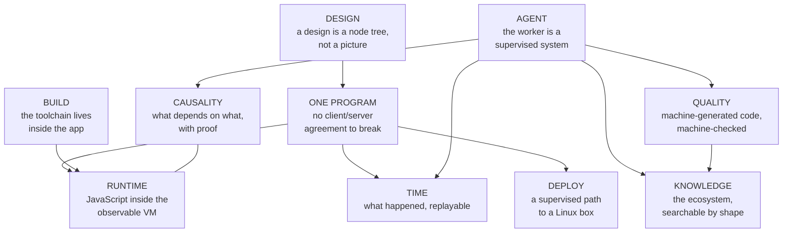

# The boundary map

*Status: draft. The one-screen picture. (A designed graphic will replace
the Mermaid rendering for the site; this stays the diffable source.)*

Each node links to its layer page. The [package graph](packages.md) shows
the same picture at repository granularity; [the chain](chain.md) shows the
main artifact's path through it; [feedback loops](loops.md) shows how
failures travel back.
