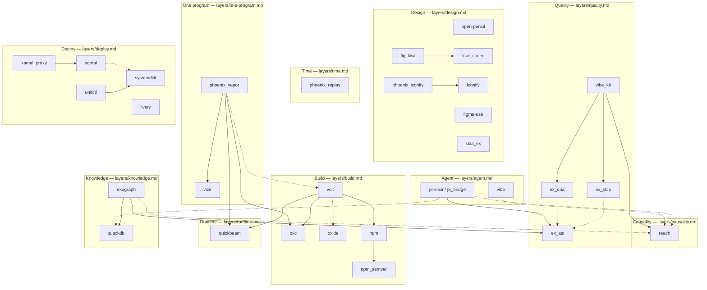

# Package graph

*Status: draft — edges verified against mix.exs/package.json files at
draft time; corrections welcome.*

Every published package, grouped by boundary, with its load-bearing
dependencies inside the ecosystem. External deps (Phoenix, LiveView, OTP)
are omitted for clarity — see each repo's mix.exs.

Solid = dependency. Dashed = optional/feeds.

## Repository index

| Package | Boundary | Repo | Hex |
|---|---|---|---|
| open-pencil | Design | [open-pencil/open-pencil](https://github.com/open-pencil/open-pencil) | — |
| figma-use | Design | [dannote/figma-use](https://github.com/dannote/figma-use) | — |
| iconify / phoenix_iconify | Design·Build | [elixir-volt](https://github.com/elixir-volt) | ✓ |
| kiwi_codec / fig_kiwi | Design | elixir-vibe | [verify] |
| skia_ex | Design | elixir-vibe | [verify] |
| phoenix_replay | Time | [elixir-vibe/phoenix_replay](https://github.com/elixir-vibe/phoenix_replay) | ✓ |
| reach | Causality | [elixir-vibe/reach](https://github.com/elixir-vibe/reach) | ✓ |
| ex_ast / ex_dna / ex_slop / vibe_kit | Quality | [elixir-vibe](https://github.com/elixir-vibe) | ✓ |
| volt / oxc / oxide / npm / npm_semver | Build | [elixir-volt](https://github.com/elixir-volt) | ✓ |
| quickbeam | Runtime | [elixir-volt/quickbeam](https://github.com/elixir-volt/quickbeam) | ✓ |
| phoenix_vapor / vize | One program | [elixir-volt](https://github.com/elixir-volt) | ✓ |
| exograph / quackdb | Knowledge | [elixir-vibe](https://github.com/elixir-vibe) | ✓ |
| pi-elixir / vibe | Agent | [elixir-vibe](https://github.com/elixir-vibe) | ✓ |
| xamal / xamal_proxy / livery / systemdkit / unitctl | Deploy | [verify orgs] | [verify] |
